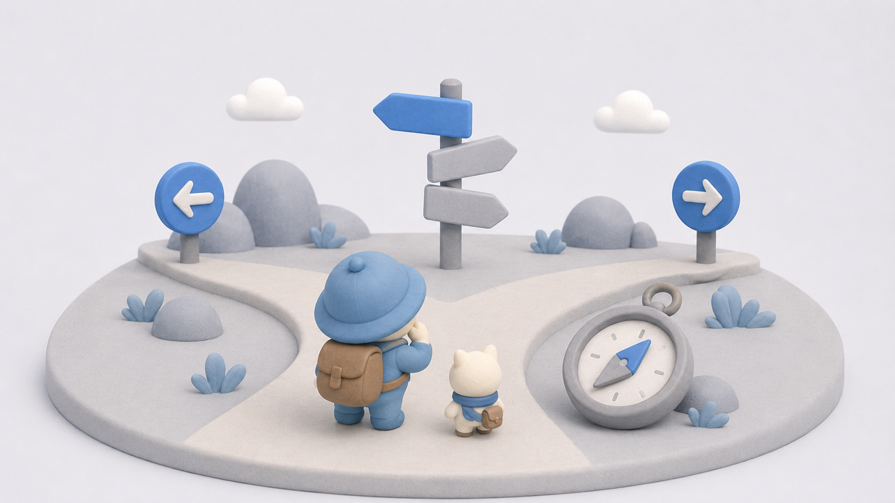

# HTML要素イラスト 仕様書

カードに使うイラストの全体テイスト・配色・構図の仕様。
各キャラクター固有の仕様は [`../characters/<name>/design.md`](../characters/) を参照。

## 参照画像

実際の生成サンプル：

3Dクレイ／プラスチック玩具風の小さなジオラマ。クリーム〜グレーのベース基壇に、キャラクターと意味論オブジェクト（道標・コンパス／イーゼル・額縁など）を配置。アクセント色は青のみ。

## 目的

HTML要素を、単なるUI図やHTMLタグの説明ではなく、「その要素が持つ意味・役割・ユーザーとの関係」が直感的に伝わる概念イラストとして表現する。
説明図ではなく、カードや教材のイラストとして使える「小さなシーン」にする。

## 全体コンセプト

HTML要素を、役割に応じた行為・関係・空間として描く。

例：

- ボタン系要素 → 押す、起動する、操作する
- ナビゲーション系要素 → 導く、道を選ぶ、移動する
- コンテンツ系要素 → 読む、内容に没入する
- ダイアログ系要素 → 対話する、開いて応答する
- セクション系要素 → 区切る、整理する
- 見出し系要素 → 情報構造の階層を示す

要素そのものを単体のアイコンにするのではなく、必要に応じてキャラクター・道具・空間・行為を組み合わせて表現する。

## 基本方針

### 要素の「役割」を描く

HTML要素を文字やタグとして描くのではなく、その要素が担う意味論的な役割をイラスト化する。

良い表現：

- 要素の役割や行為を比喩的なシーンとして表現する
- ユーザーとの関係性を描く
- 情報構造や導線を空間的に表現する
- （言語情報が必要な場合）日本語や英語ではなく、存在しない架空の文字や記号を使う

避ける表現：

- HTMLタグをそのまま描く
- ブラウザUIを描く
- ワイヤーフレーム風にする
- 実際のWebページ構造を図示する

### キャラクターは必要な場合だけ使う

キャラクターは必須ではない。要素ごとに最適な表現を選ぶ。

キャラクターを使うのは、以下を表現するために役立つ場合だけ：

- 行為
- スケール感
- 感情
- ユーザーとの関係

### 要素ごとにシーンの種類を変える

すべてを同じ構図・同じサイズ感・同じキャラクター表現にしない。
要素の意味に応じて、異なるシーンにする。

## 絵のテイスト

### 目指す方向

- ポップで親しみやすい
- 読みやすくシンプル
- UIデザイン的に視線誘導が明確
- 任天堂系の視認性
- 絵本的なわかりやすさ
- モダンなゲームUI用のコンセプトイラスト
- 教材カードに使える概念イラスト

### 描画スタイル

- **主線なし**
- 形は丸く、シンプルに省略
- 色面はくっきり分離させつつ、各面内はやわらかいグラデーションで陰影をつける
- マットな表面。強い光沢はなし
- セミフラット〜柔らかい3D感（完全フラットでも写実3Dでもない中間）
- 触覚的な柔らかさ（粘土・ぬいぐるみ・プラスチック玩具のような質感）

### 避ける表現

- 黒いアウトライン／太い漫画線
- セルシェーディング
- 完全なベタ塗り
- SVGアイコン風の硬いフラット表現
- 写実的すぎる質感
- 強い光沢
- 劇的すぎるライティング
- ダークファンタジー／中世ファンタジー／重厚なカードゲーム風

## 色のルール

### 基本方針

ポップさは出すが、色数は抑える。
**どれがHTML要素の中心モチーフなのかが一目でわかること**を最優先する。

### 配色ルール

- 背景・環境・キャラクターは低彩度にする
- 意味論上の主役オブジェクトだけにアクセントカラーを使う
- アクセントカラーは1〜2色程度に抑える
- 色数を増やしすぎない
- 全部をカラフルにしない

### 推奨パレット

ベースカラー（背景・キャラ・環境）：

- cream
- beige
- soft gray
- muted brown
- pale warm colors

アクセントカラー（主役の意味論オブジェクト）：

- muted red
- clear blue
- soft green
- gentle purple
- warm yellow

参照画像では青を一貫したアクセントカラーとして採用している。

## 構図のルール

- 主役を中央または明確な焦点位置に置く
- 背景は簡潔にする
- 余白を残す
- 小さいサイズでも判別できるシルエットにする
- 視線が迷わないようにする
- 情報量を詰め込みすぎない
- 装飾よりも意味の読みやすさを優先する
